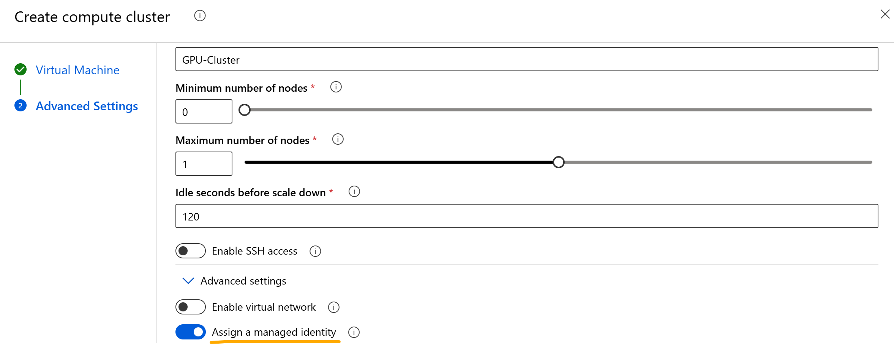
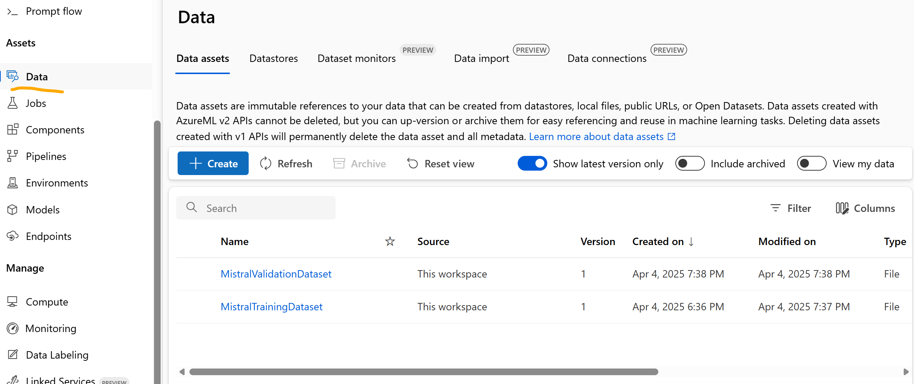
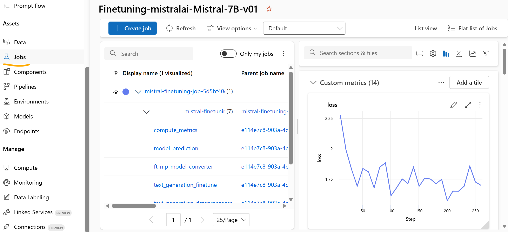
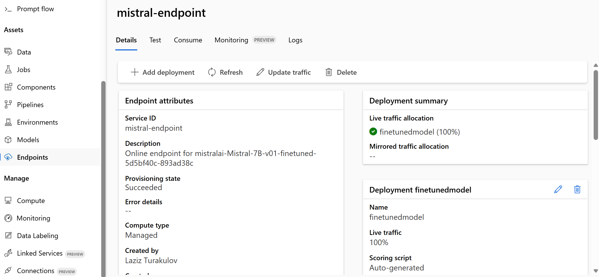

# Fine-Tuning Mistral-7B in Azure Machine Learning Studio

This repository documents the process of fine-tuning the Mistral-7B model using Azure Machine Learning (Azure ML) Studio. Azure ML Studio provides a streamlined environment for fine-tuning curated models from its model catalog. This guide walks you through the necessary steps, from environment setup to deploying the fine-tuned model.

> [!NOTE]
> The Python code and training datasets in this repo are adapted from Microsoft's [Azure Machine Learning examples](https://github.com/Azure/azureml-examples/tree/main/sdk/python/jobs/finetuning) repo.

## Table of Contents
- [Prerequisites](#prerequisites)
- [Step 1: Configuring Environment](#step-1-configuring-environment)
- [Step 2: Defining Source Model](#step-2-defining-source-model)
- [Step 3: Preparing Training and Validation Dataset](#step-3-preparing-training-and-validation-dataset)
- [Step 4: Fine-tuning Model](#step-4-fine-tuning-model)
- [Step 5: Deploying Fine-tuned Model to Online Endpoint](#step-5-deploying-fine-tuned-model-to-online-endpoint)

## Prerequisites
Before you begin, ensure you have the following prerequisites in place:
1. **Azure Subscription:** If you don't have one, you can create a free account.
2. **Azure Machine Learning Workspace:** Ensure you have the necessary permissions to create resources within the Azure ML workspace.
3. **Compute Cluster with GPU SKUs:** in the [Azure ML Studio](https://ml.azure.com), create a compute cluster with GPU SKUs suitable for fine-tuning the Mistral-7B model. Refer to the model card in the Azure ML model catalog for recommended GPU types (or check later in provided Python code).
4. **Managed Identity:** During setup of compute cluster, assign a managed identity (MI) to it as shown below. This MI should also be assigned the *Storage Blob Data Contributor* and *Storage File Data Privileged Contributor* roles to the Azure Storage account, that will host training and validation datasets.

5. **Python Packages:** Install the required Python packages:
```powershell
pip install azure-ai-ml azure-identity mlflow azureml-mlflow
```

## Step 1: Configuring Environment
1. Set up your environment variables to make provided Jupyter notebook work:

| Variable                  | Description                                      |
| ------------------------- | ------------------------------------------------ |
| `subscription_id`         | Azure subscription ID.                           |
| `resource_group`          | Azure ML resource group name.                    |
| `workspace_name`          | Azure ML workspace name.                         |
| `model_registry`          | Azure ML model registry name.                    |
| `model_name`              | Name of the model (e.g., `mistral-7b`).          |
| `training_dataset_name`   | Name of training dataset in Azure ML datastore.  |
| `training_dataset_file`   | Filename of training dataset.                    |
| `validation_dataset_name` | Name of validation dataset in Azure ML datastore.|
| `validation_dataset_file` | Filename of validation dataset.                  |
| `dataset_version`         | Version of the dataset.                          |
| `job_name`                | Name of the fine-tuning job.                     |
| `job_compute`             | Name of the compute cluster for the job.         |
| `endpoint_name`           | Name of the online endpoint.                     |
| `endpoint_SKU`            | SKU for the online endpoint deployment.          |
| `guid`                    | Unique identifier.                               |

2. Authenticate to your Azure environment:
``` Python
try:
    credential = DefaultAzureCredential()
    credential.get_token("https://management.azure.com/.default")
except Exception as ex:
    credential = InteractiveBrowserCredential()
```
3. Initialise MLClient for both Azure ML workspace and Azure ML model registry:
``` Python
workspace_ml_client = MLClient(
    credential = credential,
    subscription_id = subscription_id,
    resource_group_name = resource_group,
    workspace_name = workspace_name,
)

registry_ml_client = MLClient(
    credential = credential,
    registry_name = model_registry
)
```

## Step 2: Defining Source Model
1. Retrieve your Mistral-7B from the model registry:
``` Python
model_to_finetune = registry_ml_client.models.get(
    name = model_name,
    label = "latest"
)
```
2. You can now double check which GPU-based compute SKUs are supported by this model:
``` Python
model_to_finetune.properties["finetune-recommended-sku"]
```

## Step 3: Preparing Training and Validation Dataset
Sample training and validation datasets in JSONL format can be downloaded from this repo or the original Microsoft repo, that was referred earlier.
1. Initialise training dataset. The below code will create a new dataset from the local file, if it already doesn't exist in Azure ML workspace:
``` Python
try:
    train_data_asset = workspace_ml_client.data.get(
        name = training_dataset_name,
        version = dataset_version
    )
    print(f"Dataset {training_dataset_name} already exists! Will re-use it.")
except:
    print("Creating dataset..\n")
    train_data = Data(
        path = f"./{training_dataset_file}",
        type = AssetTypes.URI_FILE,
        description = "Training dataset",
        name = training_dataset_name,
        version = dataset_version
    )
    train_data_asset = workspace_ml_client.data.create_or_update(train_data)
```
2. You can repeat the same process to initialise validation dataset:
``` Python
try:
    val_data_asset = workspace_ml_client.data.get(
        name = validation_dataset_name,
        version = dataset_version
    )
    print(f"Dataset {validation_dataset_name} already exists! Will re-use it.")
except:
    print("Creating dataset..\n")
    val_data = Data(
        path = f"./{validation_dataset_file}",
        type = AssetTypes.URI_FILE,
        description = "Validation dataset",
        name = validation_dataset_name,
        version = dataset_version
    )
    val_data_asset = workspace_ml_client.data.create_or_update(val_data)
```
3. You can verify the existence of these datasets in the *Datasets* section of the Azure ML studio:


## Step 4: Fine-tuning Model
1. Define your finetuning job:
``` Python
finetuning_job = create_finetuning_job(
    name = f"{job_name}-{guid}",
    display_name = f"{job_name}-{guid}",
    experiment_name = f"Finetuning-{model_name}",
    model = model_to_finetune.id,
    task = FineTuningTaskType.TEXT_COMPLETION,
    training_data = train_data_asset.id,
    validation_data = val_data_asset.id,
    output_model_name_prefix = f"{model_name}-finetuned-{guid}",
    compute = job_compute,
    # instance_types = ["Standard_ND96amsr_A100_v4", "Standard_E4s_v3"],
    hyperparameters = {
        "per_device_train_batch_size": "1",
        "learning_rate": "0.00002",
        "num_train_epochs": "1",
    },
)
```
2. Then execute your job in your target Azure ML workspace:
``` Python
created_job = workspace_ml_client.jobs.create_or_update(finetuning_job)
workspace_ml_client.jobs.get(created_job.name)
```
3. Job execution's progress can be checked in Azure ML studio:

4. Alternatively, you can poll the job status programmatically:
``` Python
status = workspace_ml_client.jobs.get(created_job.name).status

while True:
    status = workspace_ml_client.jobs.get(created_job.name).status
    
    if status in ["Failed", "Completed", "Canceled"]:
        print("Job has finished with status: {0}".format(status))
        break
    else:
        print("Job run is in progress. Checking again in 30 seconds..")
        time.sleep(30)
```

## Step 5: Deploying Fine-tuned Model to Online Endpoint
if finetuning process succeeds, you are ready to deploy your model to a managed endpoint.
1. Create online endpoint to host your model:
``` Python
endpoint = ManagedOnlineEndpoint(
    name = endpoint_name,
    description = f"Online endpoint for {registered_model.name}",
    auth_mode="key"
)

workspace_ml_client.begin_create_or_update(endpoint).wait()
```
2. Then create a new deployment and allocate traffic to it:
``` Python
ft_deployment = ManagedOnlineDeployment(
    name = "finetunedmodel",
    endpoint_name = endpoint_name,
    model = deploy_model.id,
    instance_type = endpoint_SKU,
    instance_count = 1,
    liveness_probe = ProbeSettings(initial_delay=600),
    request_settings = OnlineRequestSettings(request_timeout_ms=90000),
)

workspace_ml_client.online_deployments.begin_create_or_update(ft_deployment).wait()

endpoint.traffic = {
    "finetunedmodel": 100
}

workspace_ml_client.begin_create_or_update(endpoint).result()
```
3. New managed endpoint and deployment will become visible in Azure ML studio:

4. You can test now your model's deployment from your application:
``` Python
headers = {"Content-Type": "application/json", "Authorization": ("Bearer "+ auth_key)}
url = scoring_uri.replace("/score", "/completions")
prompt = <YOUR_PROMPT>
payload = {
    "prompt": prompt,
    "temperature": 0,
    "max_tokens": 200,
}
response = requests.post(url, json=payload, headers=headers)
```
5. Your fine-tuned Mistral model should respond now in your customised format:
``` JSON
----------------
Prompt used: Summarize the dialog.
<dialog>: Edward: Rachel, at what time is the meeting..
Rachel: At 2pm..
Edward: Ok, see you then
<summary>: 

Model's response: Edward and Rachel will meet at 2pm.
----------------
Prompt token count: 48
Response token count: 12
Total token count: 60
```
